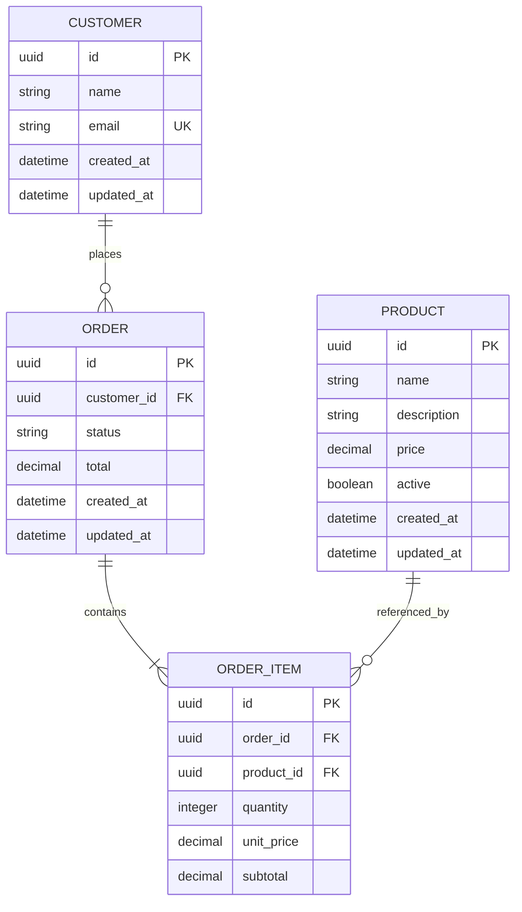

# 🧱 REST API Foundations

> **Portfolio Project** — A production-minded order management API built to demonstrate HTTP fundamentals, input validation, relational data modeling, business rules, database transactions, and automated testing.


---

## 📌 About

**REST API Foundations** is the first project in my backend engineering roadmap. Its purpose is to build a reliable REST API from first principles before moving on to authentication, asynchronous processing, and production operations in future projects.

The API models a small order management system with customers, products, orders, and order items. The domain is intentionally compact, but rich enough to exercise resource-oriented endpoint design, relational constraints, transactional writes, validation, error handling, filtering, pagination, and testing.

This project prioritizes correctness and engineering depth over feature count.

---

## 🎯 Learning Objectives

By completing this project, I intend to demonstrate the ability to:

- design resource-oriented REST endpoints;
- apply HTTP methods and status codes correctly;
- validate request bodies, route parameters, and query strings;
- model one-to-many and many-to-one relationships in PostgreSQL;
- protect data integrity with constraints and database transactions;
- separate HTTP, business, and persistence responsibilities;
- provide consistent success and error responses;
- write unit and integration tests for meaningful behavior;
- document technical decisions and API usage;
- automate linting, type checking, and tests with continuous integration.

---

## 🧭 Project Scope

### Included

- Customer creation and retrieval
- Product catalog management
- Product activation and deactivation
- Order creation with multiple items
- Server-side price and total calculation
- Controlled order status transitions
- Filtering, sorting, and pagination
- Request validation with Zod
- PostgreSQL migrations and development seed data
- Unit and integration tests
- OpenAPI documentation
- Continuous integration with GitHub Actions

### Intentionally excluded

- Authentication, sessions, and role-based access control
- Queues, workers, retries, and asynchronous jobs
- Redis and distributed caching
- Microservices
- Advanced observability and cloud infrastructure

These topics belong to later projects in the roadmap. Keeping them out of this repository protects the learning goal: mastering REST API foundations first.

---

## 🧩 Domain Model



The product price is copied to `ORDER_ITEM.unit_price` when an order is created. This preserves the original purchase value even if the product price changes later.

---

## 📏 Core Business Rules

1. A customer email must be unique.
2. Product prices must be greater than zero.
3. An order must contain at least one item.
4. Every item quantity must be a positive integer.
5. Every referenced customer and product must exist.
6. Inactive products cannot be added to new orders.
7. Item prices and order totals are calculated by the server, never accepted from the client.
8. An order and all its items are created in a single database transaction.
9. Duplicate products in an order request are rejected or consolidated consistently.
10. Order status changes must follow the allowed transition flow.

### Order status flow

```text
pending ──> confirmed ──> completed
   │
   └──────> cancelled
```

- `pending` orders can become `confirmed` or `cancelled`.
- `confirmed` orders can become `completed`.
- `completed` and `cancelled` orders are final.

---

## 📡 API Endpoints

The initial API will be exposed under `/api/v1`.

### Customers

| Method | Endpoint | Description | Success |
| --- | --- | --- | --- |
| `POST` | `/api/customers` | Creates a customer | `201 Created` |
| `GET` | `/api/customers/:customerId` | Retrieves a customer | `200 OK` |

### Products

| Method | Endpoint | Description | Success |
| --- | --- | --- | --- |
| `POST` | `/api/products` | Creates a product | `201 Created` |
| `GET` | `/api/products` | Lists and filters products | `200 OK` |
| `GET` | `/api/products/:productId` | Retrieves a product | `200 OK` |
| `PATCH` | `/api/products/:productId` | Partially updates a product | `200 OK` |
| `DELETE` | `/api/products/:productId` | Deactivates a product | `204 No Content` |

### Orders

| Method | Endpoint | Description | Success |
| --- | --- | --- | --- |
| `POST` | `/api/orders` | Creates an order and its items | `201 Created` |
| `GET` | `/api/orders` | Lists and filters orders | `200 OK` |
| `GET` | `/api/orders/:orderId` | Retrieves an order with its items | `200 OK` |
| `PATCH` | `/api/orders/:orderId/status` | Changes the order status | `200 OK` |

### Health check

| Method | Endpoint | Description | Success |
| --- | --- | --- | --- |
| `GET` | `/health` | Confirms that the application is running | `200 OK` |

---

## 🔎 Query Parameters

Collection endpoints will support predictable query parameters.

```http
GET /api/products?page=1&limit=20&active=true&sort=name&order=asc
GET /api/orders?page=1&limit=20&customerId=<uuid>&status=pending
```

Planned conventions:

- `page` starts at `1`;
- `limit` has a safe default and maximum value;
- unsupported filters and sort fields are rejected;
- list responses include pagination metadata;
- ordering is deterministic.

---

## 📦 Response Conventions

### Resource response

```json
{
  "data": {
    "id": "e6b72d0d-4f58-4498-bcb8-bc80cd72ddc4",
    "name": "Mechanical Keyboard",
    "price": "499.90",
    "active": true
  }
}
```

### Paginated response

```json
{
  "data": [],
  "meta": {
    "page": 1,
    "limit": 20,
    "total": 0,
    "totalPages": 0
  }
}
```

### Error response

```json
{
  "error": {
    "code": "PRODUCT_NOT_FOUND",
    "message": "Product not found",
    "details": []
  }
}
```

Expected error status codes include:

| Status | Usage |
| --- | --- |
| `400 Bad Request` | Malformed request or invalid query syntax |
| `404 Not Found` | Requested resource does not exist |
| `409 Conflict` | Unique constraint or invalid state conflict |
| `422 Unprocessable Content` | Structurally valid request that fails validation |
| `500 Internal Server Error` | Unexpected application failure |

---

## 🏗️ Planned Project Structure

```text
rest-api-foundations/
├── prisma/
│   ├── migrations/
│   ├── schema.prisma
│   └── seed.ts
├── src/
│   ├── modules/
│   │   ├── customers/
│   │   │   ├── customer.controller.ts
│   │   │   ├── customer.repository.ts
│   │   │   ├── customer.routes.ts
│   │   │   ├── customer.schemas.ts
│   │   │   └── customer.service.ts
│   │   ├── products/
│   │   └── orders/
│   ├── shared/
│   │   ├── database/
│   │   ├── errors/
│   │   ├── http/
│   │   └── validation/
│   ├── app.ts
│   └── server.ts
├── tests/
│   ├── integration/
│   └── unit/
├── .env.example
├── docker-compose.yml
├── package.json
├── tsconfig.json
└── README.md
```

The structure may evolve as implementation reveals real needs. Abstractions will be introduced to solve observed problems, not only to imitate a pattern.

---

## 🛠️ Technology Stack

- **Node.js** — JavaScript runtime
- **TypeScript** — static typing with strict compiler settings
- **Express** — HTTP server and routing
- **Zod** — request validation and schema inference
- **PostgreSQL** — relational database
- **Prisma** — schema, migrations, and database access
- **Jest** — unit and integration testing
- **Supertest** — HTTP integration testing
- **Docker Compose** — local PostgreSQL environment
- **ESLint and Prettier** — code quality and formatting
- **GitHub Actions** — continuous integration

---

## 🚀 Local Development

> The commands below describe the target developer workflow and will become available as the corresponding milestones are implemented.

### Requirements

- Node.js 24 or newer
- npm
- Docker and Docker Compose

### Installation

1. Clone the repository:

   ```bash
   git clone https://github.com/barbosacaio/rest-api-foundations.git
   cd rest-api-foundations
   ```

2. Install dependencies:

   ```bash
   npm install
   ```

3. Create the environment file:

   ```bash
   cp .env.example .env
   ```

4. Start PostgreSQL:

   ```bash
   docker compose up -d
   ```

5. Apply migrations and seed the database:

   ```bash
   npm run db:migrate
   npm run db:seed
   ```

6. Start the development server:

   ```bash
   npm run dev
   ```

---

## 🧪 Quality Checks

The planned commands are:

```bash
npm run lint
npm run typecheck
npm test
npm run test:integration
npm run build
```

The continuous integration workflow must run linting, type checking, tests, and the production build on every pull request.

Testing will focus on observable behavior and important business rules rather than pursuing an arbitrary coverage percentage.

---

## 🗺️ Implementation Roadmap

### Phase 1 — Foundation

- [x] Initialize Node.js and strict TypeScript configuration
- [x] Configure Express and environment validation
- [x] Add linting, formatting, and development scripts
- [x] Add the health-check endpoint
- [ ] Configure PostgreSQL, Prisma, and Docker Compose

### Phase 2 — Product catalog

- [ ] Model customers and products
- [ ] Create and apply the first migration
- [ ] Implement customer creation and retrieval
- [ ] Implement product CRUD behavior
- [ ] Add validation and centralized error handling
- [ ] Add pagination, filtering, and sorting

### Phase 3 — Orders

- [ ] Model orders and order items
- [ ] Implement transactional order creation
- [ ] Calculate item subtotals and order totals on the server
- [ ] Implement order retrieval and listing
- [ ] Enforce valid order status transitions

### Phase 4 — Verification

- [ ] Add unit tests for business rules
- [ ] Add integration tests for endpoints and database behavior
- [ ] Isolate and reset the test database
- [ ] Add OpenAPI documentation
- [ ] Configure GitHub Actions

### Phase 5 — Delivery

- [ ] Add seed data and complete setup instructions
- [ ] Record relevant architectural decisions
- [ ] Review HTTP semantics and response consistency
- [ ] Run the complete quality pipeline
- [ ] Mark the project as complete

---

## ✅ Definition of Done

The project is considered complete when:

- a new developer can run it using only this README;
- migrations and seed data work against an empty database;
- all request inputs are validated consistently;
- order creation is atomic;
- monetary calculations do not use floating-point arithmetic;
- invalid status transitions are rejected and tested;
- API errors follow the documented contract;
- core business rules have unit tests;
- endpoints and persistence behavior have integration tests;
- lint, type checking, tests, and build pass in CI;
- every endpoint is represented in the OpenAPI specification;
- the repository history shows incremental implementation decisions.

---

## 🧠 Engineering Principles

- Prefer a small, correct API over a large superficial one.
- Keep controllers focused on HTTP concerns.
- Keep business rules independent from Express.
- Treat the database as an integrity boundary, not only as storage.
- Use transactions when a use case must succeed or fail as a unit.
- Represent money with fixed-precision decimal values or integer minor units.
- Avoid premature abstractions and unnecessary dependencies.
- Make errors explicit, predictable, and useful to API consumers.
- Test behavior and contracts instead of implementation details.

---

## 🤝 Contributing

This is a personal portfolio and learning project, but suggestions and feedback are welcome. Feel free to open an [issue](https://github.com/barbosacaio/rest-api-foundations/issues).

---

## 👤 Author

**Caio Barbosa**

- GitHub: [@barbosacaio](https://github.com/barbosacaio)
- LinkedIn: [Caio Henrique Barbosa](https://www.linkedin.com/in/barbosacaio/)
- Portfolio: [barbosacaio-portfolio.pages.dev](https://barbosacaio-portfolio.pages.dev/)

---

Made with care as the foundation of a progressive backend engineering roadmap.
